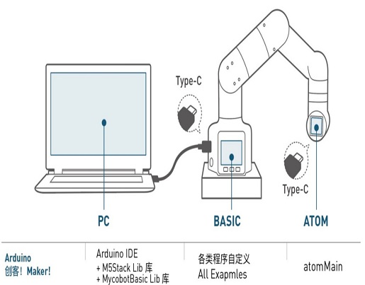
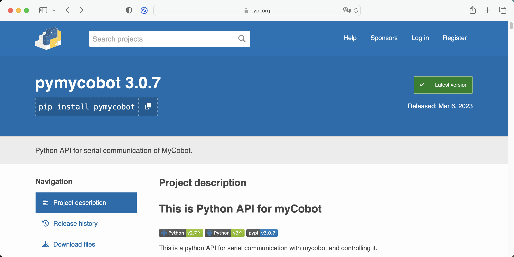
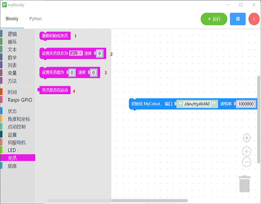
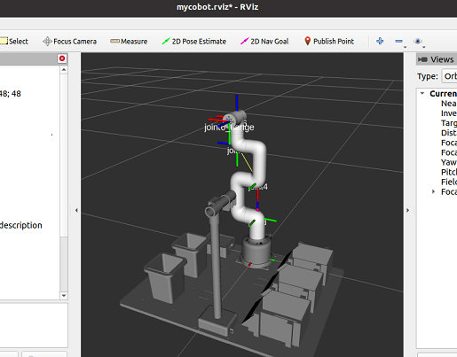

# Development Environment Construction

## 1 How to Build the Environment

The Arduino IDE, board package, driver and MyCobotBasic library are covered
step by step in
[6.1 Arduino environment setup](../../6.developmentGuide/Arduino/10.1-arduino_download.md).

## 2 Development and use based on Arduino
Arduino is an easy-to-use, easy-to-use open source electronic prototyping platform, including hardware (various development boards that meet Arduino specifications) and software (Arduino IDE and related development packages). The hardware part (or development board) consists of a microcontroller (MCU), flash memory, and a set of general input/output interfaces (GPIO). You can think of it as a microcomputer motherboard. The software part mainly consists of the Arduino IDE on the PC side, the related board support package (BSP), and a rich third-party function library. Users can easily download the BSP and required function libraries related to the development board you have through the Arduino IDE to write your program. We have an open source library MyCobotBasic, which is an open source robot control library developed by our company. It can only be used with robots developed by our company. Using this library, you can control our robot through Bluetooth, WiFi, serial port, etc., and it also supports external sensors, IIC communication, LED lights and other functions. You can DIY different application scenarios according to your needs, or refer to the MiniRobot sample code or angle, coordinate, gripper and other control cases we provide. The MiniRobot sample code contains control-related content such as Bluetooth, WiFi, drag teaching, and distance sensors. After the user installs the Arduino environment, you can directly view the simple use of Arduino and related interfaces. For details, please refer to the Arduino Development Guide section.  

## 3 Development and use based on Python
Our robots support Python, and the development of Python API libraries is becoming more and more complete. You can control the robot's joint angles, coordinates, grippers, etc. through Python. Refer to **python development related chapters** for more information.

## 4 Development and use based on Blockly
myBlockly is a fully visual modular programming software, which belongs to a graphical programming language. For details, please refer to the relevant chapters based on myBlockly development.

## 5 Development based on ROS
ROS is open source and is a post-operating system, or secondary operating system, for robot control. Through ROS, we can achieve simulation control of the robot arm in a virtual environment. We will use the rviz platform to visualize the robot arm and use a variety of methods to operate our robot arm; use the moveit platform to plan and execute the robot arm's motion path to achieve free control of the robotThe effect of the arm.

The emergence of ROS solved the communication problem of various parts of the robot. Later, more and more robot algorithms were integrated into ROS. **ROS2** inherited **ROS** and is more powerful and better than **ROS**.
Compared with **ROS**, which only supports Linux systems, **ROS2** also supports **windows**, **mac**, and even **RTOS** platforms. For more details about ROS and ROS2 development, please refer to the relevant chapters.
