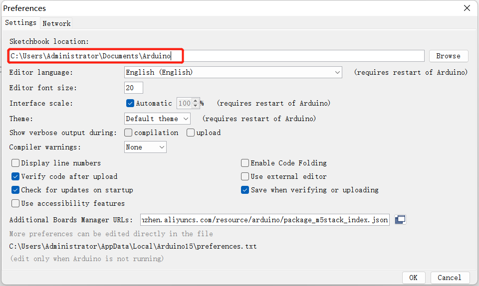
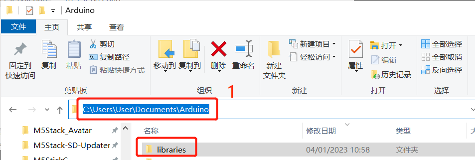

# Arduino environment setup

## **Arduino IDE** download

Download **Arduino IDE** You can click [**Arduino official website**](https://www.arduino.cc/en/software) to download and install the version corresponding to the computer system.

- [Download and install the Arduino IDE](https://support.arduino.cc/hc/en-us/articles/360019833020-Download-and-install-Arduino-IDE) — official installation guide, always current for Windows, macOS and Linux.

## Install the driver

A USB-serial driver is needed to flash the **Atom** board at the end of the
arm with myStudio. Download the **CP210X** or **CH34X** package below for your
operating system. After decompressing the package, select the installation
package corresponding to the operating system bit number to install.

The main-control board may not need a driver of its own: Arduino MKR and
UNO R4 boards are native USB devices, and UNO / MEGA 2560 are recognised by
Windows 10 and 11 without one.

For **Mac OS**, before installing, make sure **System Preferences-->Security & Privacy-->General** and allow **CP2104** drivers to be downloaded from the App Store and approved developers

* [Windows10](https://download.elephantrobotics.com/software/drivers/CP210x_VCP_Windows.zip)

* [MacOS](https://download.elephantrobotics.com/software/drivers/CP210x_VCP_MacOS.zip)

* [Linux](https://download.elephantrobotics.com/software/drivers/CP210x_VCP_Linux.zip)

After unzipping the compressed package, select the corresponding installation package according to the **operating system** of the computer for installation (select x64 or x86 for win10 and win11).

**CP34X**

- [ **Windows10** ](https://download.elephantrobotics.com/software/drivers/CH9102_VCP_SER_Windows.exe)

- [ **MacOS** ](https://download.elephantrobotics.com/software/drivers/CH9102_VCP_MacOS.zip)
## Add development board

Install the board package for the main-control board you are using. Open
**Tools --> Board --> Boards Manager**, search for the package and click
Install:

| Main control | Board package to install |
| :----------: | :----------------------: |
| Arduino UNO / MEGA 2560 | Arduino AVR Boards (usually preinstalled) |
| Arduino MKR WiFi 1010 | Arduino SAMD Boards |
| Arduino UNO R4 WiFi / Minima | Arduino UNO R4 Boards |

After installing, select **Tools --> Board** and check that the board appears
in the list.

## Add related libraries

Install MyCobotBasic library 

**Note:** Please download the latest library, the first version is v0.0.1.

* Click to download related dependency libraries
- [**MycobotBasic**](https://github.com/elephantrobotics/MyCobotBasic/tags)(After importing the Mycobot280-Arduino model, you can refer to arduino_use for use). Please see the figure below for details. .zip is suitable for Windows system, and .tar.gz is suitable for Linux system: 

* Dependent library installation instructions

First check the location of the Arduino project folder. You can view it by clicking File --> Preferences (you can copy the path to the hard disk path to find the libraries folder)

---

---

1 Copy the path here and press enter to find the libraries folder

Unzip to the corresponding folder **libraries** directory. If you are using **Arduino**, please do not overwrite, just add it to the existing **Library**.

At this point, congratulations, you have built the **Arduino** related development environment.

Note: For Arduino environment configuration and case compilation, you can watch our video on Bilibili (https://www.bilibili.com/video/BV1Vi4y1c7DQ/).

# Use of Arduino library

Supported robot arm type: **myCobot280-Arduino** 

Use case: For example, open **C:\Users\User\Documents\Arduino\libraries\MyCobotBasic\examples\MyCobot280\MyCobot280_Arduino\Mega\AnglesControl\AnglesControl.ino**. This case requires burning the development board first and then connecting it to the robot arm, otherwise the upload will fail.  

Using the basic library at the bottom, you can freely develop under Arduino and control our company's robot arm.  

## 1 Modifications before compiling

Import library files. If your robot arm is myCobot280-Arduino, please check whether the development board is Mega2560 or Uno. If it is: 

1.1 Please put **MyCobotBasic\lib\avr-libstdcpp** under **C:\Users\User\Documents\Arduino\libraries**: 

 

 

## 2 Select the development board before compiling

2.1 The development board is Uno or Mega2560, Tools --> Development Board --> Arduino AVR Boards --> Arduino Uno (or Arduino MEAG or Mega2560), see the following figure for details:

 
1 When using uno,select 
2 When using Mega2560, select 

2.2 The development board is mkr wifi1010 
Search for samd in the development board manager. If it is not installed, install it. First, Tools --> Development Board --> Development Board Manager, then search for samd, see the following figure for details:

 

 

Development board selects mkr wifi1010, tools --> development board --> Arduino SAMD --> Arduino MKR WiFi1010

 