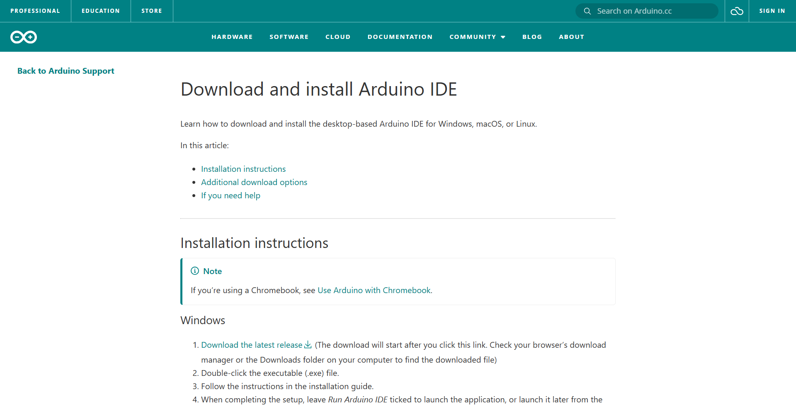
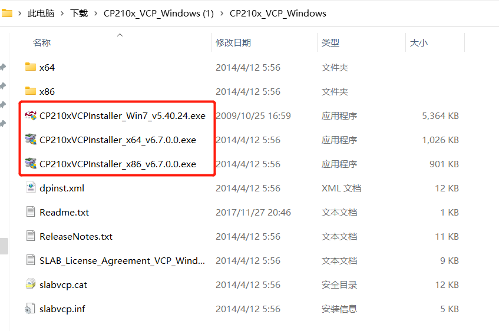
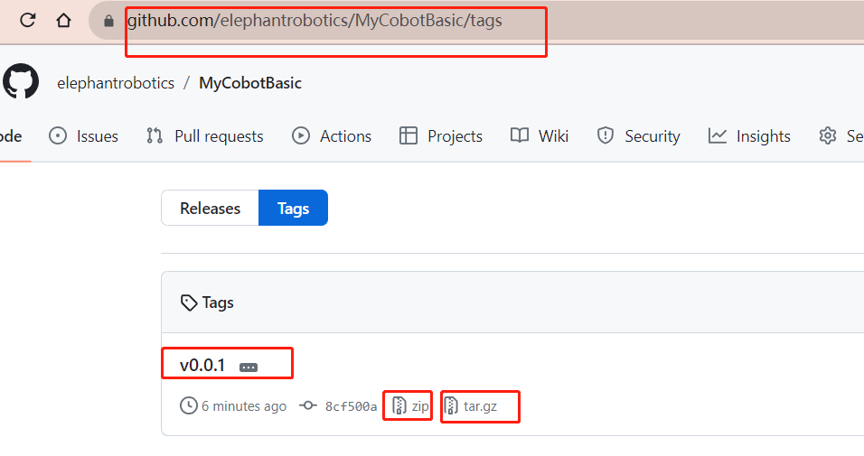
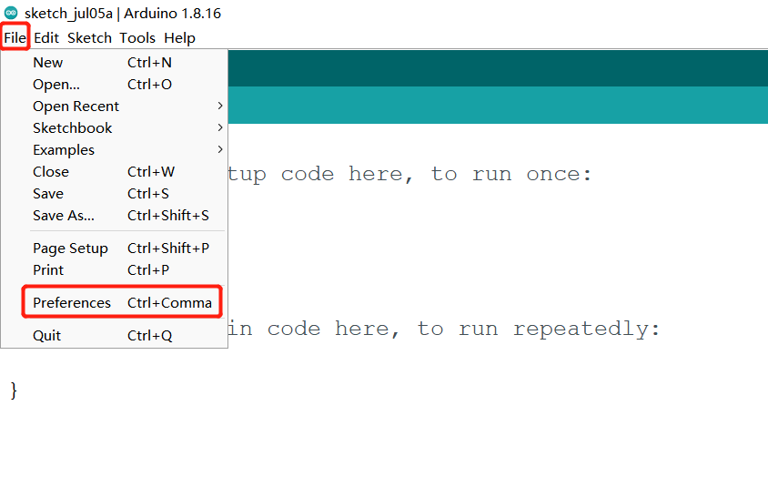
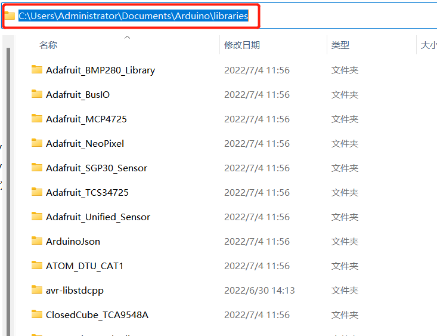

# Arduino environment setup (UNO R4)

A complete walkthrough from a fresh Arduino IDE to a moving arm, using an
**Arduino UNO R4** as the main-control board. Follow it in order; each step
states what you should see before moving on.

There are two routes. **Route A** is faster and has nothing to configure.

| | Route A — standalone project | Route B — MyCobotBasic library |
|---|---|---|
| Library install | none | required |
| `ParameterList.h` edit | none | required |
| Gives you | transponder firmware | all official examples |
| Best for | driving the arm from Python | trying the bundled demos |

---

## 1 Install the Arduino IDE



Follow the official guide:
[Download and install the Arduino IDE](https://support.arduino.cc/hc/en-us/articles/360019833020-Download-and-install-Arduino-IDE).
Version 2.x is recommended.

## 2 Install the board package

The Renesas core is **not** installed by default.

1. **Tools --> Board --> Boards Manager**
2. Search for **Arduino UNO R4 Boards**
3. Click **Install**

**Check:** **Tools --> Board** now lists *Arduino UNO R4 Boards*.

For reference, the package needed by each main-control option:

| Main control | Board package |
| :----------: | :-----------: |
| Arduino UNO / MEGA 2560 | Arduino AVR Boards (usually preinstalled) |
| Arduino MKR WiFi 1010 | Arduino SAMD Boards |
| Arduino UNO R4 WiFi / Minima | Arduino UNO R4 Boards |

## 3 Install the driver

The UNO R4 needs **no driver** — it enumerates as a native USB CDC device on
Windows 10/11, macOS and Linux.

A USB-serial driver is still needed to flash the **Atom** board at the end of
the arm with myStudio. After decompressing, select the installation package
matching your operating system (x64 or x86 for Windows 10 and 11).

**CP210X**

- [ **Windows10** ](https://download.elephantrobotics.com/software/drivers/CP210x_VCP_Windows.zip)
- [ **MacOS** ](https://download.elephantrobotics.com/software/drivers/CP210x_VCP_MacOS.zip)
- [ **Linux** ](https://download.elephantrobotics.com/software/drivers/CP210x_VCP_Linux.zip)

**CH34X**

- [ **Windows10** ](https://download.elephantrobotics.com/software/drivers/CH9102_VCP_SER_Windows.exe)
- [ **MacOS** ](https://download.elephantrobotics.com/software/drivers/CH9102_VCP_MacOS.zip)



For **Mac OS**, before installing, make sure **System Preferences --> Security
& Privacy --> General** allows drivers from the App Store and approved
developers.

## 4 Connect the board and confirm the port

Connect the UNO R4 to the PC with a USB-C cable, with **nothing wired to the
arm yet**.

**Tools --> Port** should show the board. From a terminal:

```
$ arduino-cli board list
Port  Protocol Type              Board Name          FQBN                          Core
COM13 serial   Serial Port (USB) Arduino UNO R4 WiFi arduino:renesas_uno:unor4wifi arduino:renesas_uno
```

If nothing appears, **try a different USB cable first** — charge-only cables
carry no data lines and are the most common cause.

## 5 Get the code

### Route A — standalone project

```bash
git clone https://github.com/vhp8rc7p/MyCobot280_R4_Transponder.git
```

Open `MyCobot280_R4_Transponder.ino`. Nothing else to install: the project
bundles the library files it needs, already configured for the R4.

Skip to **step 7**.

### Route B — MyCobotBasic library

Download the latest release of
[**MyCobotBasic**](https://github.com/elephantrobotics/MyCobotBasic/tags)
(.zip for Windows, .tar.gz for Linux).



Find your Arduino project folder under **File --> Preferences**, then unzip
into its `libraries` directory, keeping the folder named exactly
`MyCobotBasic`.



| OS | Path |
| :--: | :--: |
| Windows | `Documents\Arduino\libraries\MyCobotBasic` |
| macOS | `~/Documents/Arduino/libraries/MyCobotBasic` |
| Linux | `~/Arduino/libraries/MyCobotBasic` |



Restart the Arduino IDE.

## 6 Configure the library (Route B only)

Replace the library's root `ParameterList.h` with the UNO R4 profile:

```bash
cd MyCobotBasic
cp examples/MyCobot280/MyCobot280_Arduino/Mkr/ParameterList.h  ParameterList.h
```

Or edit the root `ParameterList.h` by hand — lines 10 and 13:

```diff
-#define MyCobot_M5 "m5"
+//#define MyCobot_M5 "m5"

-//#define MyCobot_Mkr "mkr"
+#define MyCobot_Mkr "mkr"
```

The `MyCobot_Mkr` profile maps the arm link to `Serial1` (pins D0/D1), which is
what the UNO R4 needs. Do **not** select `MyCobot_Uno`: that maps the arm to
`Serial`, which on an R4 is the USB port, and it pulls in an AVR-only
compatibility library that fails to compile.

> **Edit the copy in the library root, not the one in the example folder.**
> `examples/.../Mkr/ParameterList.h` is already configured, which makes it look
> like the file to change. It is a template to copy *from* — the build ignores
> it. Editing it and rebuilding gives the identical M5Stack error.

**Check:** the root `ParameterList.h` has `MyCobot_M5` commented out and
`MyCobot_Mkr` active.

Then open an example:
**File --> Examples --> MyCobotBasic --> MyCobot280 --> MyCobot280_Arduino --> Mkr --> AnglesControl**

Use the **`Mkr`** folder. The `Mega` folder is for a MEGA 2560 main control and
maps the arm to a different serial port.

> **`Mkr/Transponder.ino` needs a one-line fix before it will compile for the
> R4:**
>
> ```
> Transponder.ino:131:11: error: reference to 'data' is ambiguous
> ```
>
> The sketch has `using namespace std;`, and the R4 core pulls in `<array>`
> and `<string>`, which declare `std::data`. Rename the global on line 14 and
> its five uses (131-133, 146, 147, 152):
>
> ```diff
> -int count = -1, data = -1;
> +int count = -1, rx_byte = -1;
> ```
>
> Leave `client_data`, `temp_data`, `atom_data` and `v_data` alone.
> `AnglesControl`, `CoordsControl` and `GripperControl` compile unmodified.

## 7 Select the board

**Tools --> Board --> Arduino UNO R4 Boards --> Arduino UNO R4 WiFi**
(or **Minima**), then **Tools --> Port -->** your port.

## 8 Compile

Click **Verify**. Expect roughly:

```
Sketch uses 52604 bytes (20%) of program storage space. Maximum is 262144 bytes.
Global variables use 6908 bytes (21%) of dynamic memory, leaving 25860 bytes.
```

If it fails:

| Message | Cause |
|---|---|
| `#error "This library only supports boards with ESP32 processor."` | step 6 not applied, or applied to the wrong file |
| `reference to 'data' is ambiguous` | `Mkr/Transponder.ino` — apply the rename |
| `fatal error: stddef: No such file` | `MyCobot_Uno` selected instead of `MyCobot_Mkr` |

## 9 Upload

Click **Upload**. Expect `Done in ~3 seconds`.

If it fails with `Serial port busy` or `No device found`:

1. Close anything holding the port — Serial Monitor, a Python session, a REPL.
2. **Retry.** The R4 often needs a moment to settle after a port is released.
   Two failures followed by success on an identical third attempt is normal.

## 10 Verify the board before touching the arm

With the transponder flashed and **no arm connected**, the R4 answers this
itself:

```
send: fe fe 02 c1 fa
recv: fe fe 03 c1 18 fa
```

`0x18` = 24 = `SYSTEM_VERSION` for a myCobot 280.

```python
import serial, time
s = serial.Serial("COM13", 115200, timeout=1)
time.sleep(2.5)                       # the R4 resets when the port opens
s.write(bytes([0xFE, 0xFE, 0x02, 0xC1, 0xFA]))
time.sleep(0.5)
print(s.read(6).hex())                # -> fefe03c118fa
s.close()
```

This proves toolchain, configuration, firmware and USB path in one step,
before any wiring can confuse the picture.

## 11 Wire the arm

**Power the arm down first.** Cross TX and RX, tie the grounds:

```
R4 D1 (TX)  ---->  arm RX
R4 D0 (RX)  <----  arm TX
R4 GND      -----  arm GND
```

Read the 5 V / 3.3 V caution in
[5.3 Hardware Interface](../../5.BasicFunction/5.3-FirmwareFunctionDescription/RoboticArmElectricalInterface.md)
before powering up.

## 12 Talk to the arm

```python
import time
from pymycobot import MyCobot280

mc = MyCobot280("COM13", 115200)
time.sleep(2.5)

print(mc.is_controller_connected())   # 1
print(mc.get_system_version())        # a number = arm link is good
print(mc.get_angles())                # 6 values
```

If everything returns `-1`, no bytes are arriving — that is wiring or power,
not software. Check, in order: the arm has its own power; D0/D1 are **crossed**
(R4 TX to arm RX); grounds are tied. A useful signature of TX-to-TX wiring is
silence at *every* baud rate, not just the wrong one.

## 13 First movement

Only once telemetry reads correctly. Check the current pose so you know how far
the arm will travel, clear the workspace, and use a low speed:

```python
print(mc.get_angles())
mc.send_angles([0, 0, 0, 0, 0, 0], 20)
```

Wait for a move to finish with `is_moving()`, not by comparing successive
`get_angles()` samples. Immediately after `send_angles()` the arm has not
started yet, so two equal reads look like "finished" and the next command
clobbers the move in flight:

```python
def wait_until_idle(mc, timeout=20.0):
    time.sleep(0.4)                   # let the move actually start
    t0 = time.time()
    while time.time() - t0 < timeout:
        if mc.is_moving() == 0:       # 1 moving, 0 stopped, -1 error
            break
        time.sleep(0.2)
    return mc.get_angles()
```

---

## Command-line equivalent

The same build without the IDE:

```bash
arduino-cli core install arduino:renesas_uno

arduino-cli compile --fqbn arduino:renesas_uno:unor4wifi ./MyCobot280_R4_Transponder
arduino-cli upload  --fqbn arduino:renesas_uno:unor4wifi -p COM13 ./MyCobot280_R4_Transponder
```

For Route B, add `--library /path/to/MyCobotBasic`.
