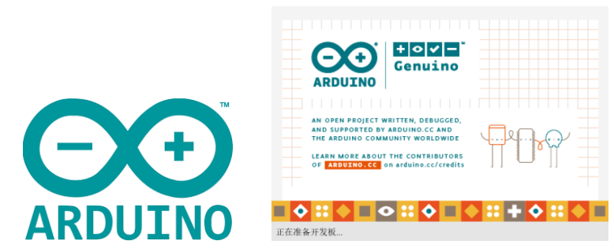

# Arduino

## What is Arduino?

**Arduino** is an easy-to-use, easy-to-use open source electronic prototyping platform, which includes hardware (various development boards that meet Arduino specifications) and software (Arduino IDE and related development kits).
The hardware part (or development board) consists of a microcontroller (MCU), flash memory (Flash) and a set of general input/output interfaces (GPIO), etc. You can think of it as a microcomputer motherboard.
The software part mainly consists of the PC-side Arduino IDE and related board support packages (BSP) and rich third-party function libraries. Users can easily download the BSP and required function libraries related to the development board you have through Arduino IDE to write your program.

## What can MyCobotBasic library do?
MyCobotBasic library is an open source robot control library developed by our company. It can only be used with robots developed by our company. With this library, you can control our robots through Bluetooth, WiFi, serial ports, etc., and it also supports external sensors, IIC communication, LED lights and other functions. You can DIY different application scenarios according to your needs, or refer to the MiniRobot sample code or angle, coordinate, gripper and other control cases we provide. The MiniRobot sample code contains control-related content such as Bluetooth, WiFi, drag teaching, and distance sensors.

**Applicable devices:**

- myCobot 280
- myCobot 280 M5
- myCobot 280 for Arduino  

## Arduino development guide

You can use it according to the following instructions Arduino develops our robotic arm
1. [Environment setup](10.1-arduino_download.md)
2. [API description](10.3-api.md)

## Arduino development board connection guide

The myCobot 280 for Arduino version is developed and used based on PC and development board. **There is no built-in system inside the robot**, so the robot, PC and development board need to be combined during use, so please prepare a PC and development board before use. **Please connect the PC and development board before development**.

For powering on, wiring and checking the port, see
[4. First Use — Hardware connection](../../../2-BasicSettings/4.FirstTimeInstallation/4-FirstTimeInstallation.md).
